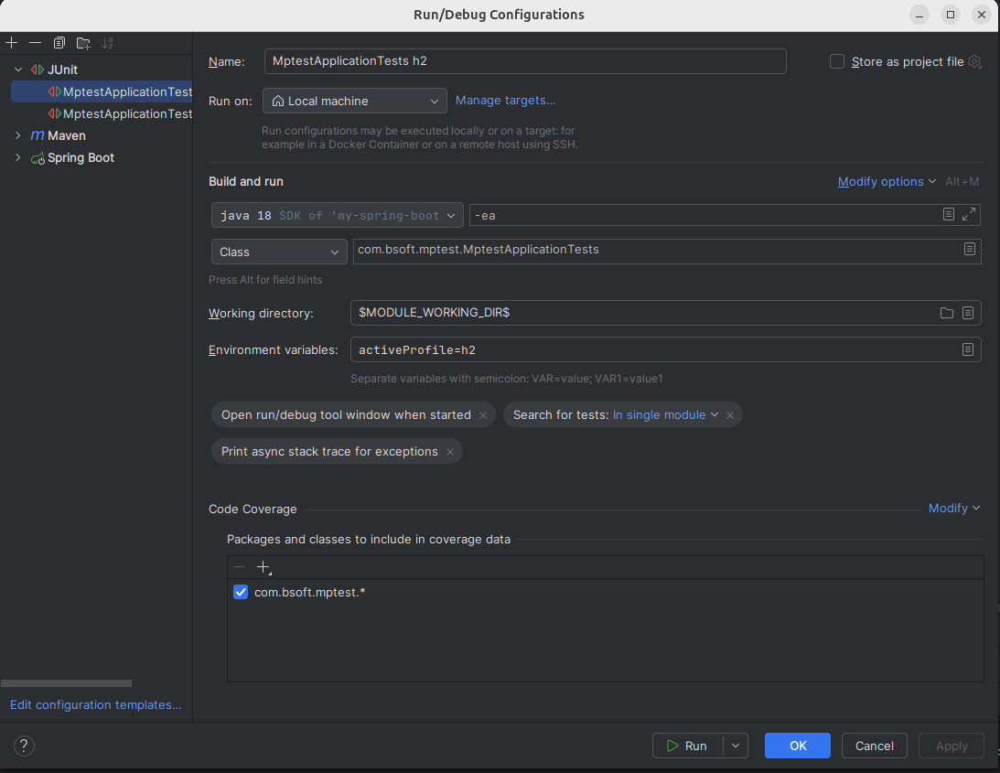
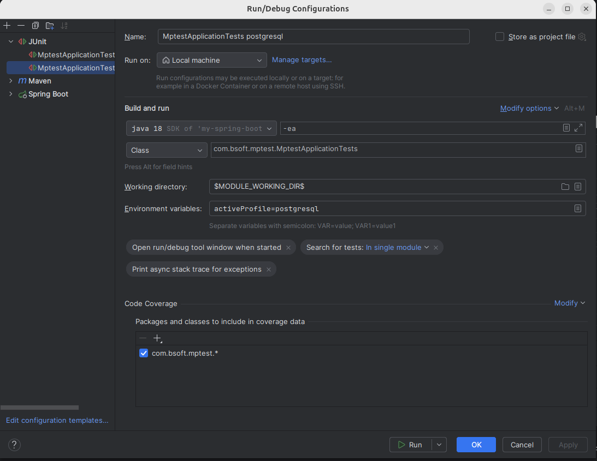
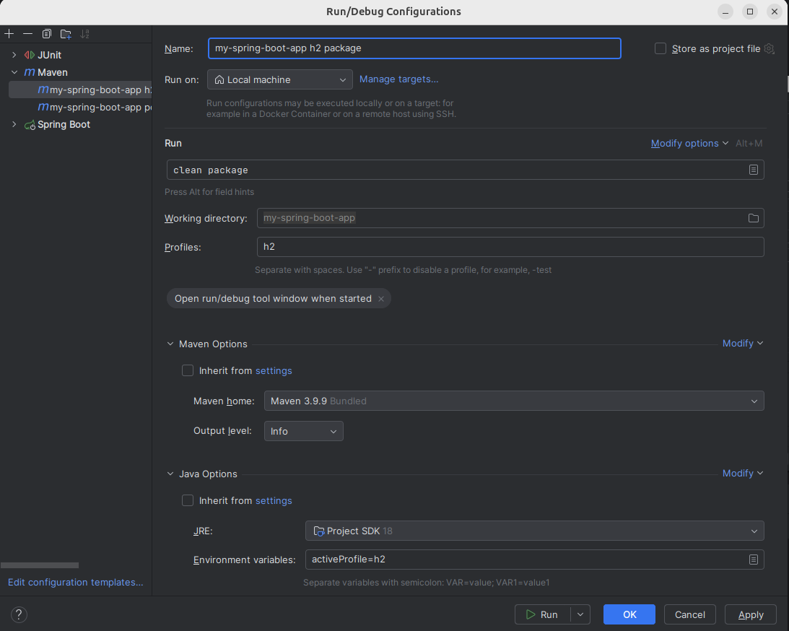
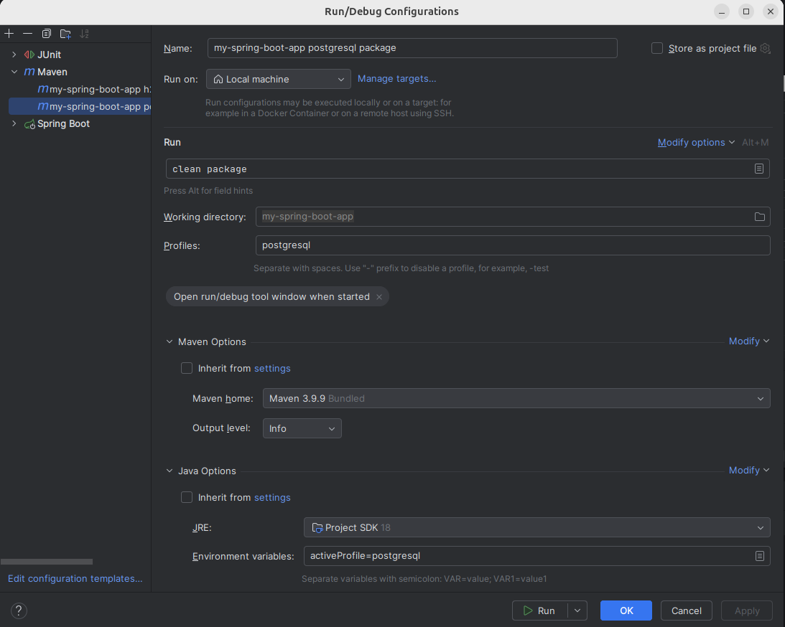
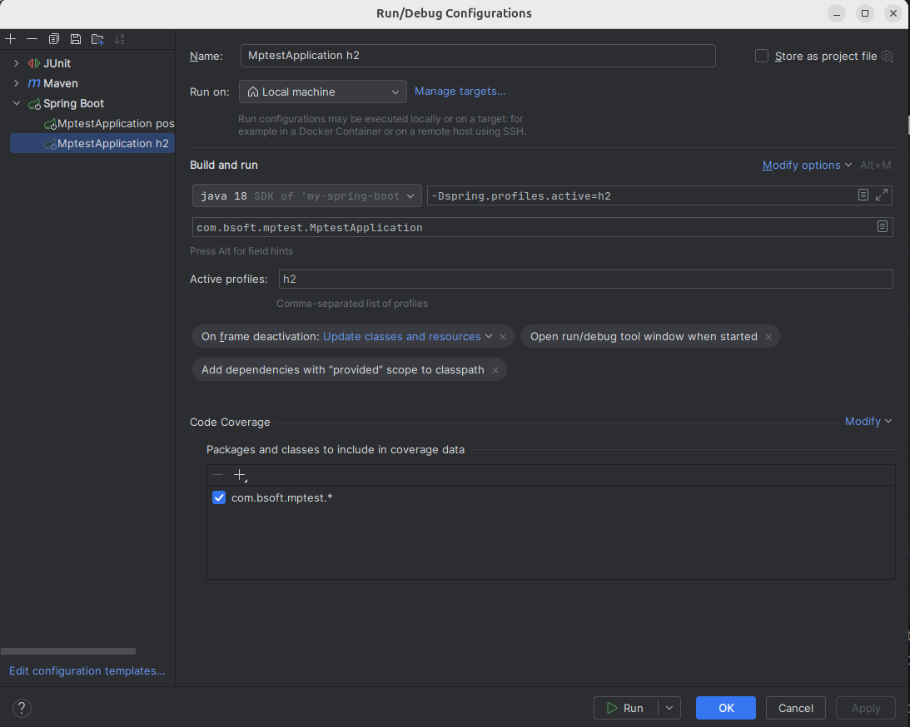
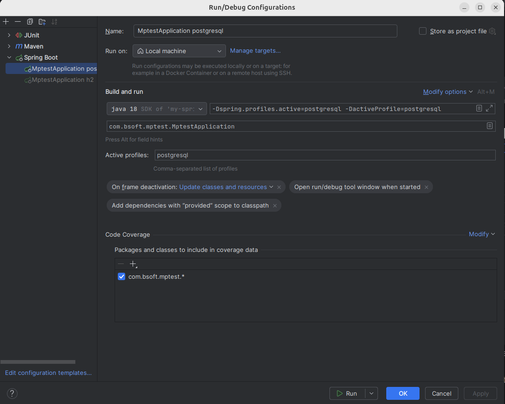

# MPTest

Find out how to use multiprofile maven projects

In order to find the database drivers for h2 and postgresql both should be in the pom.xml dependencies section.
Conditional compilation based on the profile with only the needed database drivers does not work.

Setup:

| profile name | database   |
|--------------|------------|
| h2           | h2         |
| postgresql   | postgresql |

[pom.xml](./pom.xml)

```xml
<?xml version="1.0" encoding="UTF-8"?>
<project xmlns:xsi="http://www.w3.org/2001/XMLSchema-instance" xmlns="http://maven.apache.org/POM/4.0.0"
         xsi:schemaLocation="http://maven.apache.org/POM/4.0.0 https://maven.apache.org/xsd/maven-4.0.0.xsd">
    <modelVersion>4.0.0</modelVersion>

    <parent>
        <groupId>org.springframework.boot</groupId>
        <artifactId>spring-boot-starter-parent</artifactId>
        <version>3.3.5</version>
        <relativePath/>
    </parent>

    <groupId>com.example</groupId>
    <artifactId>my-spring-boot-app</artifactId>
    <version>0.0.1-SNAPSHOT</version>
    <name>My Spring Boot App</name>
    <description>Demo project for Spring Boot</description>

    <properties>
        <java.version>17</java.version>
    </properties>

    <dependencies>
        <dependency>
            <groupId>org.springframework.boot</groupId>
            <artifactId>spring-boot-starter-web</artifactId>
        </dependency>
        <dependency>
            <groupId>org.springframework.boot</groupId>
            <artifactId>spring-boot-starter-data-jpa</artifactId>
        </dependency>
        <dependency>
            <groupId>org.flywaydb</groupId>
            <artifactId>flyway-core</artifactId>
        </dependency>
        <dependency>
            <groupId>org.projectlombok</groupId>
            <artifactId>lombok</artifactId>
            <optional>true</optional>
        </dependency>
        <dependency>
            <groupId>org.springframework.boot</groupId>
            <artifactId>spring-boot-devtools</artifactId>
            <scope>test</scope>
            <optional>true</optional>
        </dependency>
        <dependency>
            <groupId>org.springframework.boot</groupId>
            <artifactId>spring-boot-starter-test</artifactId>
            <scope>test</scope>
        </dependency>

        <dependency>
            <groupId>com.h2database</groupId>
            <artifactId>h2</artifactId>
            <version>2.2.220</version>
        </dependency>
        <dependency>
            <groupId>org.postgresql</groupId>
            <artifactId>postgresql</artifactId>
        </dependency>
        <dependency>
            <groupId>org.flywaydb</groupId>
            <artifactId>flyway-database-postgresql</artifactId>
        </dependency>

    </dependencies>

    <profiles>
        <profile>
            <id>h2</id>

            <properties>
                <spring.profiles.active>h2</spring.profiles.active>
            </properties>
        </profile>
        <profile>
            <id>postgresql</id>
            <activation>
                <activeByDefault>true</activeByDefault>
            </activation>
            <properties>
                <spring.profiles.active>postgresql</spring.profiles.active>
            </properties>
        </profile>
    </profiles>

    <build>
        <plugins>
            <plugin>
                <groupId>org.springframework.boot</groupId>
                <artifactId>spring-boot-maven-plugin</artifactId>
            </plugin>
        </plugins>
    </build>
</project>
```

## Commandline

| action | command                                                                    | description                   |
|--------|----------------------------------------------------------------------------|-------------------------------|
| test   | mvn clean test -P h2 -DactiveProfile=h2                                    | Test using h2 profile         |
| test   | mvn clean test -P postgresql -DactiveProfile=postgresql                    | Test using postgresql profile |
| run    | mvn clean -P h2 -DactiveProfile=h2 compile spring-boot:run                 | Run using h2 profile          |
| run    | mvn clean -P postgresql -DactiveProfile=postgresql compile spring-boot:run | Run using postgresql profile  |

## Intellij

| action      | command                                                                         | description                    |
|-------------|---------------------------------------------------------------------------------|--------------------------------|
| test        | see [h2 test configuration](#h2-test-configuration)                             | Test using h2 profile          |
| test        | see [postgresql test configuration](#postgresql-test-configuration)             | Test using postgresql profile  |
| maven       | see [maven h2 configuration](#maven-h2-configuration)                           | maven using h2 profile         |
| maven       | see [maven postgresql configuration](#maven-postgresql-configuration)           | maven using postgresql profile |
| spring-boot | see [springboot h2 configuration](#springboot-h2-configuration)                  | maven using h2 profile         |
| spring-boot | see [springboot postgresql configuration](#springboot-postgresql-configuration) | maven using postgresql profile |

### h2 test configuration

In the Environment variables the parameters are

Environment variables: activeProfile=h2



### postgresql test configuration

In the Environment variables the parameters are

Environment variables: activeProfile=postgresql



### maven h2 configuration

In the Environment variables the parameters are.

After building a package the package should be started with:

```bash
java -jar -DactiveProfile=h2 -Dspring.profiles.active=h2 ./target/my-spring-boot-app-0.0.1-SNAPSHOT.jar
```

Profiles: h2

Environment variables: activeProfile=h2



### maven postgresql configuration

In the Environment variables the parameters are.

After building a package the package should be started with:

```bash
java -jar -DactiveProfile=postgresql -Dspring.profiles.active=postgresql ./target/my-spring-boot-app-0.0.1-SNAPSHOT.jar
```

Profiles: postgresql

Environment variables: activeProfile=postgresql



### springboot h2 configuration

Active profiles: h2



### springboot postgresql configuration

Active profiles: postgresql

